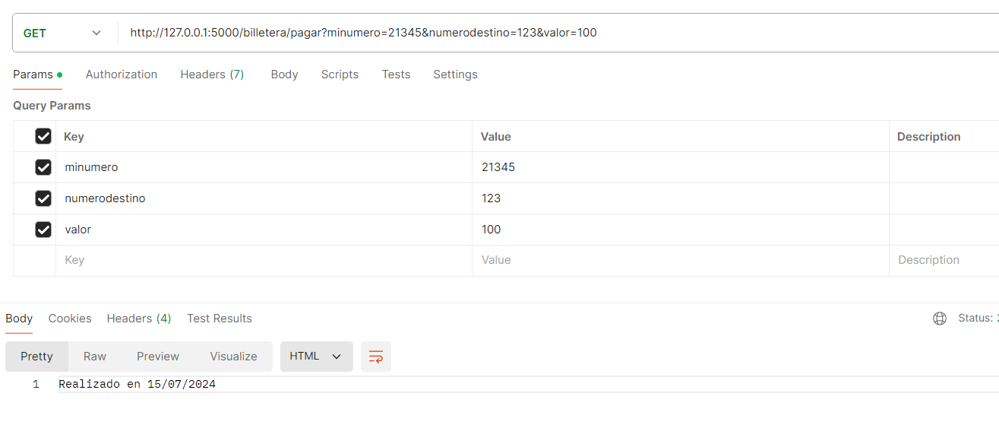
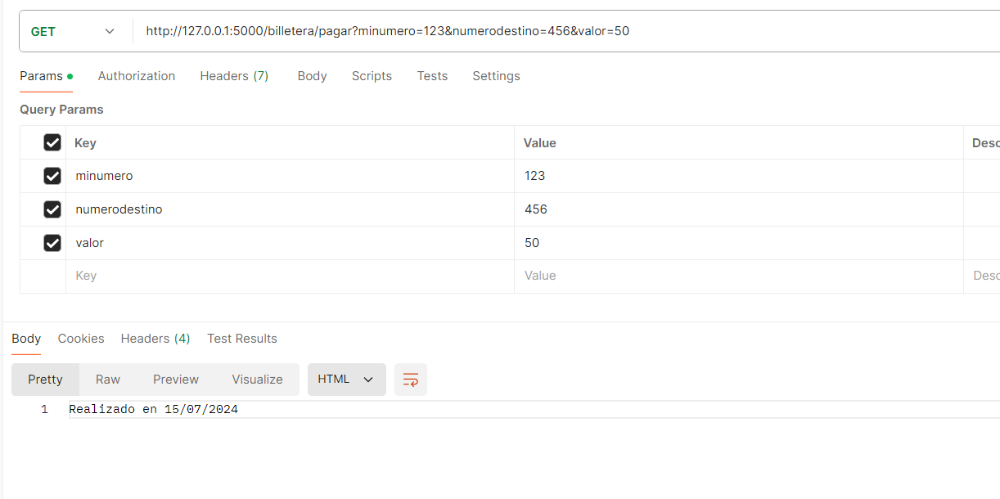
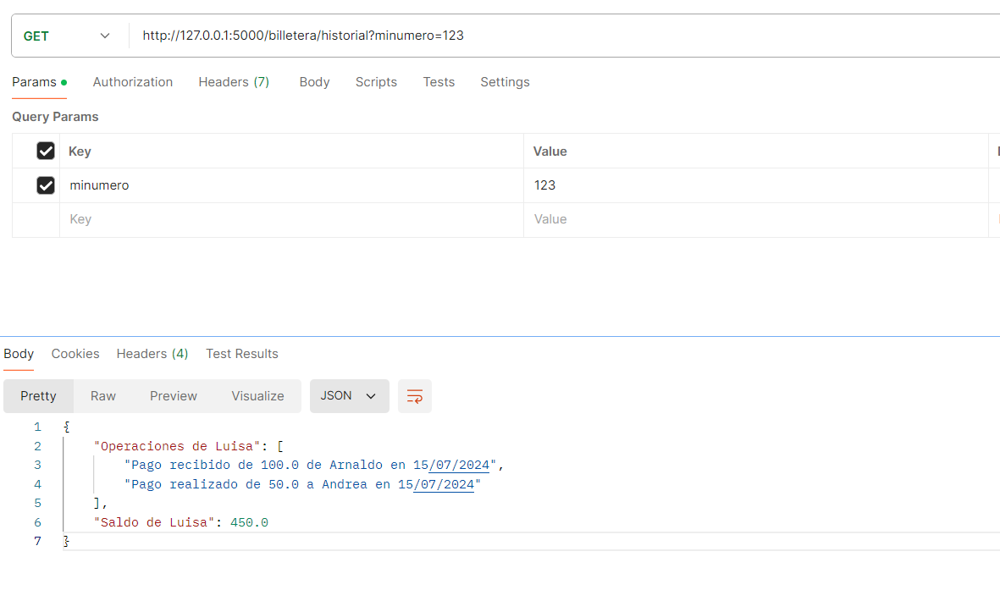

# Examen-Final
# Billetera Electrónica

## Descripción
Este proyecto implementa una billetera electrónica que permite listar contactos, realizar pagos y ver el historial de transacciones.

## Instalación
1. Clonar el repositorio.
2. Instalar las dependencias:
   ```
   pip install -r requirements.txt
   ```

## Ejecución
Ejecutar la Aplicación:
```
python run.py
```

#  Pregunta 1

## Endpoints
- `/billetera/contactos?minumero=XXXX`
- `/billetera/pagar?minumero=XXXX&numerodestino=YYYY&valor=ZZZZ`
- `/billetera/historial?minumero=XXXX`


***Comprobamos que el code funciona***
- Contactos:
  <p align="center">
  
</p>

- Pagar (100):
    <p align="center">
  
</p>

- Pagar (50):
    <p align="center">
  
</p>

- Historial:
    <p align="center">
  
</p>

# Pregunta 2
Realizar 5 pruebas unitarias: 2 de caso de éxito y 3 de error. Incluir las pruebas unitarias en el mismo repositorio Github.
Adicionar comentarios en cada prueba indicando el caso de prueba.
Las pruebas unitarias deben ser sobre los objetos y no sobre los “GET”.

Archivo de pruebas: `test_app.py`

Correr test: `python -m unittest test_app.py`

# Pregunta 3

Se requiere realizar un cambio en el software para que soporte un valor máximo de 200 soles a transferir por día.
Qué	cambiaría	en	el	código (Clases / Métodos) - No realizar la implementación, sólo descripción.
Qué casos de prueba nuevos serían necesarios?
Los casos de prueba existentes garantizan que no se introduzcan errores en la funcionalidad existente?

- Clases/métodos
- Casos de prueba necesarios
- Garantía de los casos existentes
