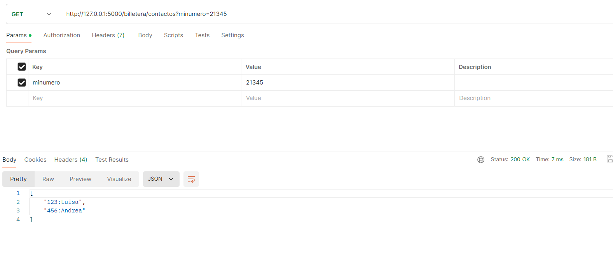

# Examen-Final
# Billetera Electrónica

## Descripción
Este proyecto implementa una billetera electrónica que permite listar contactos, realizar pagos y ver el historial de transacciones.

## Instalación
1. Clonar el repositorio.
2. Instalar las dependencias:
   ```
   pip install -r requirements.txt
   ```

## Ejecución
Ejecutar la Aplicación:
```
python run.py
```

## Endpoints
- `/billetera/contactos?minumero=XXXX`
- `/billetera/pagar?minumero=XXXX&numerodestino=YYYY&valor=ZZZZ`
- `/billetera/historial?minumero=XXXX`


***Comprobamos que el code funciona***
- Contactos:
  <p align="center">
  
</p>

